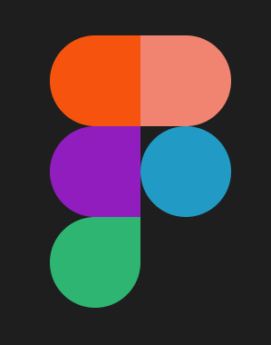

# “Моделювання логотипа в Figma”

## План виконання роботи

1. Створити фрейм
2. Створити 5 Rectangles та розмістити їх на фреймі
3. Налаштувати закруглення кутів у Rectangles
4. Покрасити Rectangles у відповідні кольори

## Результат

Виконане завдання можна знайти за посиланням: 
[https://www.figma.com/design/SfMarNkXOQXBpL3AmHXVw6/PZ2?node-id=0-1&t=xAV1NptSFDt58pRZ-1](https://www.figma.com/design/LeEKncbsm5dKb7ImBivmNB/Figma-Logo?node-id=0-1&p=f&t=KoufzuoL1r4lN0pB-0)
