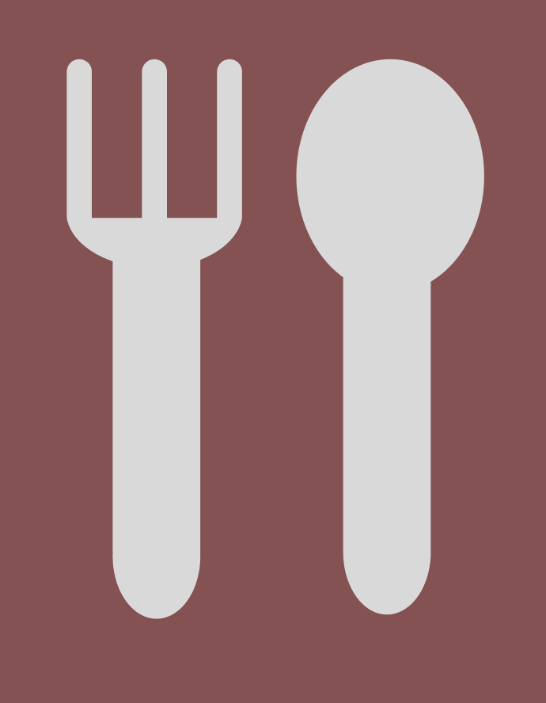
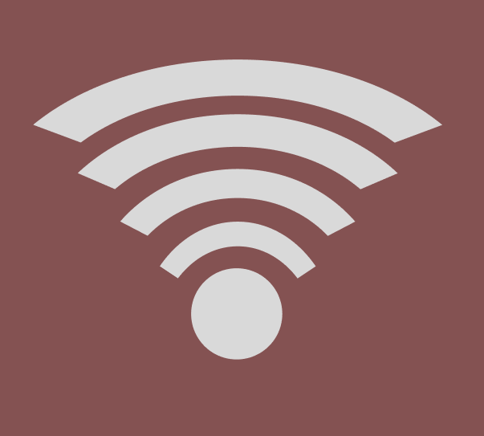

# Завдання 4
## Використання булевих операцій

Результат 3 іконки(їжа(веделка та ложка), пульс, та wi-fi):

Виконане завдання можна знайти за посиланням:
https://www.figma.com/design/4VDUATqIzj8vMKdYEZ3r0v/Untitled?t=wACNGDd112M0XAqZ-0
