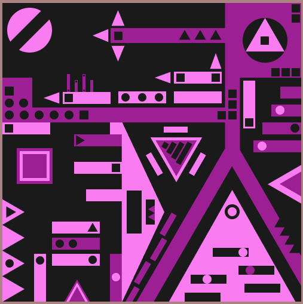

# Створення візерунку с використанням простих фігур

Результат:

Виконане завдання можна знайти за посиланням:
https://www.figma.com/design/hhWuK83bsk53ZqPhUGRbnx/Pattern?node-id=0-1&p=f&t=VgosRqrkjfKsm6Jt-0
