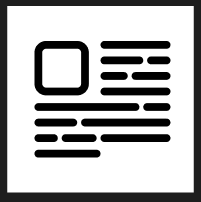
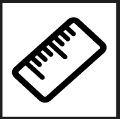
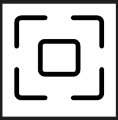
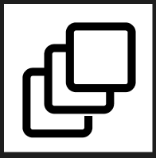
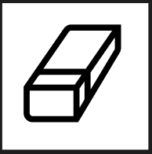

# Криві Безьє, векторні об'єкти  у Figma. Створення векторних значків (іконок).

---

## Завдання: створирити 5 іконок за вибором зі списку: https://drive.google.com/file/d/1Vanbvj57RCkxzjc9l3226L7qfGmYZt9L/view

## Результат:

Виконане завдання можна знайти за посиланням:
https://www.figma.com/design/Vt2AxoKx7xy6QQpNEWv13l/Pen-tool?node-id=0-1&p=f&t=eU3s9Hoh00kpRd7w-0
